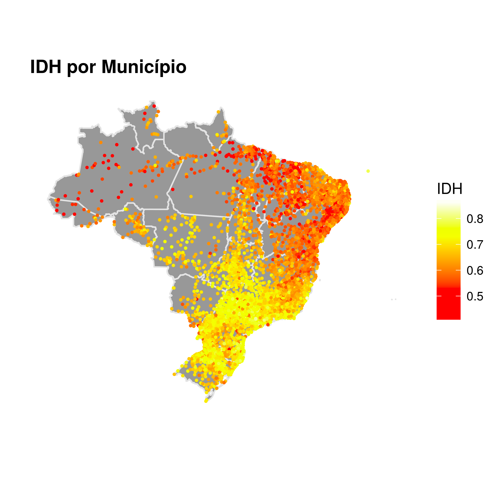
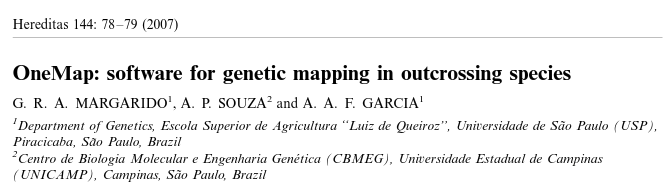
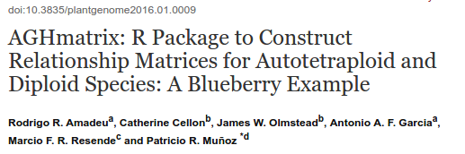
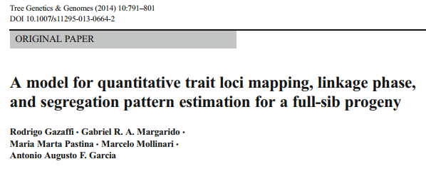

```{r setup, include=FALSE}
knitr::opts_chunk$set(echo = TRUE)
```

<style>
  .col2 {
    columns: 2 200px;         /* number of columns and width in pixels*/
    -webkit-columns: 2 200px; /* chrome, safari */
    -moz-columns: 2 200px;    /* firefox */
  }
  .col3 {
    columns: 3 100px;
    -webkit-columns: 3 100px;
    -moz-columns: 3 100px;
  }
</style>


##
```{r, out.width = 800, fig.retina = NULL, echo=FALSE}

```

##
```{r, out.width = 350, fig.retina = NULL, echo=FALSE}
knitr::include_graphics("figures/Rlogo.svg")
```

Freely available language and environment for statistical computing and graphics which provides a wide variety of statistical and graphical techniques. It's GNU!!!

https://www.r-bloggers.com/r-moves-up-to-5th-place-in-ieee-language-rankings/

##
```{r, out.width = 350, fig.retina = NULL, echo=FALSE}
knitr::include_graphics("figures/gnu_linux.png")
```

**GNU** philosophy

+ to run the program
+ to study and change the program in source code form
+ to redistribute exact copies
+ to distribute modified versions

##
```{r, out.width = 350, fig.retina = NULL, echo=FALSE}
knitr::include_graphics("figures/Rlogo.svg")
```
<div class="col2">
+ Data Science
+ Statistics
+ Modeling
+ Graphics
+ Programming language
+ Free
+ Open Source
+ Extensible
+ Repeatability!
</div>

## R Theory
From Ihaca [Speech](https://www.stat.auckland.ac.nz/~ihaka/downloads/JSM-2010.pdf):

R provides An interactive, extensible, vectorised language with a large run-time environment
which provides a good deal of statistical functionality and good graphics capabilities.
It comes with the the freedom to inspect, modify and redistribute the source code.
Extensive “third-party solutions” are available through the CRAN websites. User support
is available through community mechanisms.

Open R!


## Interfaces: RStudio
[Different interfaces](https://en.wikipedia.org/wiki/R_(programming_language)#Interfaces)

```{r, out.width = 400, fig.retina = NULL, echo=FALSE}
knitr::include_graphics("figures/Rstudio.png")
```

Overview

## Practice
`script.R`

## From here to where? 
* Graphics

[Basic + ggplot2](http://www.r-graph-gallery.com/)

[Course](https://rramadeu.github.io/2016/07/07/Graphics-Course/)

[RCircos](https://www.ncbi.nlm.nih.gov/pmc/articles/PMC3765848/)

## From here to where? 
Based on [here](http://zevross.com/blog/2014/07/16/mapping-in-r-using-the-ggplot2-package/)
```{r, out.width = 600, fig.retina = NULL, echo=FALSE}

```

## Interactive Plot w/ plot.ly
https://plot.ly/r/

https://plot.ly/~rramadeu/1.embed

## Shiny Apps
http://shinyapps.stat.ubc.ca/r-graph-catalog/

http://rosetta.ahmedmoustafa.io/drift/

## From here to where? 
* Report (Rmd) on RStudio
[Tarefa](file:///home/rramadeu/Dropbox/mestrado/curso_R_Biometria2017/report_example/tarefa7.pdf)

* knitr + xelatex
[Report](file:///home/rramadeu/Dropbox/mestrado/curso_R_Biometria2017/report_example/report_lab.pdf)

## From here to where? 
* Presentation (Rmd)

[index.Rmd](https://raw.githubusercontent.com/rramadeu/Introduction-to-R/gh-pages/index.Rmd)


## More about R? Tutorials

https://www.coursera.org/learn/r-programming

https://www.datacamp.com/courses/free-introduction-to-r

http://tryr.codeschool.com/

http://swirlstats.com/

## More about R? Tutorials

* Old school

https://cran.r-project.org/doc/contrib/Verzani-SimpleR.pdf

https://cran.r-project.org/doc/manuals/R-intro.pdf

## More about R? Online Community

http://stackoverflow.com/

http://rseek.org/

[Google!](https://www.google.com.br/?gfe_rd=cr&ei=s-gYWKeZGNHV8wfOzZHwCA#q=R+Cran)

## Advanced R
Dates? _lubridate_

http://vita.had.co.nz/papers/tidy-data.pdf

http://tidyverse.org/

https://www.rstudio.com/resources/webinars/working-with-big-data-in-r/

https://www.coursera.org/learn/advanced-r

[Hadley Wickham](http://hadley.nz/)

[Roger D Peng](http://www.biostat.jhsph.edu/~rpeng/)

## Packages R

From [here](http://tinyheero.github.io/jekyll/update/2015/07/26/making-your-first-R-package.html)

<blockquote class="twitter-tweet" data-lang="pt"><p lang="en" dir="ltr">&quot;I wish I&#39;d left this code across scattered .R files instead of combining it into a package&quot; said no one ever <a href="https://twitter.com/hashtag/rstats?src=hash">#rstats</a> <a href="http://t.co/udeNH4T67H">http://t.co/udeNH4T67H</a></p>&mdash; David Robinson (@drob) <a href="https://twitter.com/drob/status/611885584584441856">19 de junho de 2015</a></blockquote>
<script async src="//platform.twitter.com/widgets.js" charset="utf-8"></script>

## Packages R

R scripts:

- 1x routine: ok, just comment it
- 2x routine: wrap it in a function
- 2+ routine: wrap them in a package

http://kbroman.org/pkg_primer/

http://tinyheero.github.io/jekyll/update/2015/07/26/making-your-first-R-package.html

https://support.rstudio.com/hc/en-us/articles/200486488-Developing-Packages-with-RStudio


## Here at Genetics... 

[onemap](https://github.com/augusto-garcia/onemap)
```{r, out.width = 500, fig.retina = NULL, echo=FALSE,fig.align='center'}

```

[AGHmatrix](https://github.com/prmunoz/AGHmatrix)
```{r, out.width = 500, fig.retina = NULL, echo=FALSE,fig.align='center'}

```

## Here at Genetics... 

```{r, out.width = 200, fig.retina = NULL, echo=FALSE}
knitr::include_graphics("figures/coming-soon.png")
```
```{r, out.width = 500, fig.retina = NULL, echo=FALSE,fig.align='center'}

```


## Here at Genetics...

**Statistical-Genetics Lab**

- Prof Augusto Garcia
- http://statgen.esalq.usp.br

**Bioinformatics Applied to Bioenergy Lab**

- Prof Gabriel Margarido
- http://www.genetica.esalq.usp.br/bioinfo

##

<iframe width="854" height="480" src="https://www.youtube.com/embed/HeERupuicHE" frameborder="0" allowfullscreen></iframe>

rramadeu@gmail.com

## Tips for better and faster scripts (1)
+ ALWAYS save your script (`ctrl+s` on RStudio)!
+ Pay attention where you are working `getwd()`.
+ Always verify the data `class()` and/or `str()`.
+ When building long scripts save your objects. `save("today.Rdata")` saves current objects on a file, `load("today.Rdata"")` loads it on future. Do it at the script end to keep tracking on future, so you don't need to run everything again on next time.
+ If `factor`, check how many levels has.
+ When possible, organize the objects in dataframes and lists.
+ Alocate the memory before run a long loop/script.
+ Follow the memory and processor usage along a long script.

## Tips for better and faster scripts (2)
+ Do not create a lot of big objects, replaces the ones that already exists (track them with `ls()`).
+ Prefer matrix algebra to elementy-wise algebra. Think in matrix terms.
+ Prefer `apply()` family functions to loops. It is faster and wisely.
+ Be careful with `attach()` & `dettach()`.
+ AVOID `while()`.
+ AVOID `require()`, use `library()`; [why?](http://yihui.name/en/2014/07/library-vs-require/).
+ Track your functions and loops with `print()` and `cat()`.
+ `( A %*% B ) %*% C` is faster than `A %*% B %*% C`.

## Tips for better and faster scripts (3)
+ `crossprod()` is faster than `%*%`.
+ If a procedure is obvious, probably there is a package with a function to do it. Just google.
+ ...
